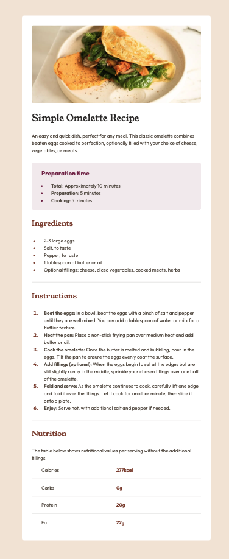

# Frontend Mentor - Recipe page solution

This is a solution to the [Recipe page challenge on Frontend Mentor](https://www.frontendmentor.io/challenges/recipe-page-KiTsR8QQKm). Frontend Mentor challenges help you improve your coding skills by building realistic projects. 

## Table of contents

- [Frontend Mentor - Recipe page solution](#frontend-mentor---recipe-page-solution)
  - [Table of contents](#table-of-contents)
  - [Overview](#overview)
    - [Screenshot](#screenshot)
    - [Links](#links)
  - [My process](#my-process)
    - [Built with](#built-with)
    - [Useful resources](#useful-resources)
  - [Author](#author)

## Overview

### Screenshot

### Links

- Solution URL: [View on Frontend Mentor]()
- Live Site URL: [View on Vercel]()

## My process

### Built with

- [React](https://reactjs.org/) - JS library
- [Next.js](https://nextjs.org/) - React framework
- [Tailwind CSS](https://tailwindcss.com/) - Utility-first CSS framework

### Useful resources

- [Tailwind cheatsheet](https://nerdcave.com/tailwind-cheat-sheet) - Quick reference for Tailwind class names.

## Author

- Website - [Nick Abate](https://nickabate.dev/)
- Frontend Mentor - [@nickabate](https://www.frontendmentor.io/profile/nickabate)
- Twitter - [@thatdevnick](https://twitter.com/thatdevnick)

